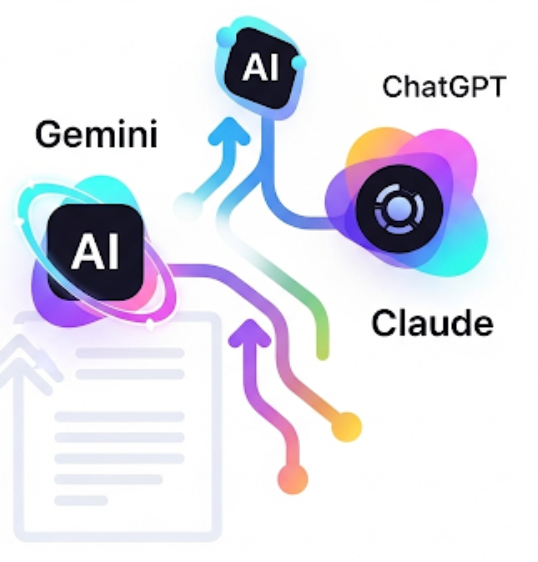

<table align="center">
  <tr>
    <td width="33%" align="start" valign="middle">
      
    </td>
    <td align="left" valign="middle">
      <h1>🚀 Carlos Alvarez</h1>
      <h2>Senior Lead Software Engineer</h2>
      <strong>Remote (New Jersey, USA) | US Citizen</strong> 
      <em>React, TypeScript, Node.js & Fullstack | Generative AI-Powered Development</em>
    </td>
  </tr>
</table>

  
<strong>About Me</strong>

  <ul>
    <li>Architects and develops intuitive UIs for hybrid cloud environments (software & hardware).</li>
    <li>Expert in React.js, Remix, TypeScript, Node.js, and AI-driven workflows (Copilot, ChatGPT, Gemini, Claude).</li>
    <li>Delivers robust, scalable solutions with comprehensive testing (Jest, Playwright, Cypress).</li>
    <li>Cloud platforms: AWS, Azure. Microservices, REST, and serverless architectures.</li>
    <li>Dedicated to high-quality, impactful software that drives business value.</li>
    <li>Experience with React, JavaScript, C#, .NET, WPF, SQL, and other technologies.</li>
  </ul>

---

<h3>💼 Recent Employment</h3>

  
<strong>HPE</strong> <em>| Senior Software Development Engineer</em>   <small>March 2023 – Present</small>

  <ul>
    <li>Lead Senior UI Engineer for hybrid cloud management (software & hardware).</li>
    <li>React.js, Jest, Playwright, Cypress, AWS, proprietary service deployment.</li>
    <li>AI tools: Copilot, Gemini, ChatGPT, Claude for test writing, logic analysis, and code optimization.</li>
    <li>Technologies: React, Remix, Typescript, Javascript, AWS, Playwright, Cypress, Jest, Figma.</li>
  </ul>

  
<strong>Federal Reserve Bank</strong> <em>| Sr. Software Engineer (Remote)</em>   <small>March 2022 – March 2023</small>

  <ul>
    <li>Developed consumer web app UI in React & Typescript.</li>
    <li>Built AWS serverless microservices: Lambda (NodeJs), DynamoDB, SNS, SQS.</li>
    <li>Achieved near 100% unit test coverage with Jest & Cypress.</li>
    <li>Full-stack contributions from AWS to UI.</li>
  </ul>

  
<strong>Hewlett Packard Enterprise</strong> <em>| Senior Software Consultant (Remote)</em>   <small>March 2021 – March 2022</small>

  <ul>
    <li>Built UI for HPC cluster management (React/Functional).</li>
    <li>Designed Yarn config editor for cloud portal.</li>
    <li>Technologies: React.js, Cypress, Kubernetes, slurm, GIT, Sonar, Yarn, Npm.</li>
  </ul>

---

<h3>📫 Contact</h3>

  <a href="https://linkedin.com/in/jstechy"><strong>LinkedIn</strong></a> | <a href="mailto:tractfine@gmail.com">tractfine@gmail.com</a>

